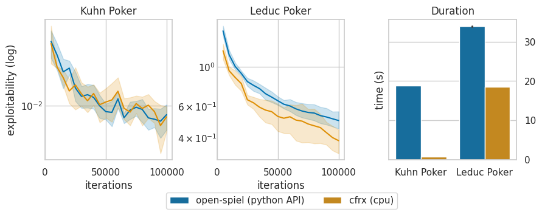

# cfrx: Counterfactual Regret Minimization in Jax.

cfrx is an open-source library designed for efficient implementation of counterfactual regret minimization (CFR) algorithms using JAX. It focuses on computational speed and easy parallelization on hardware accelerators like GPUs and TPUs.

Key Features:

- **JIT Compilation for Speed:** cfrx makes the most out of JAX's just-in-time (JIT) compilation to minimize runtime overhead and maximize computational speed.

- **Hardware Accelerator Support:** It supports parallelization on GPUs and TPUs, enabling efficient scaling of computations for large-scale problems.

- **Python/JAX Ease of Use:** cfrx provides a Pythonic interface built on JAX, offering simplicity and accessibility compared to traditional C++ implementations or prohibitively slow pure-Python code.

## Installation

    pip install cfrx

## Getting started

An example notebook is available [here](examples/mccfr.ipynb).

Snippet for training a MCCFR-outcome sampling on the Kuhn Poker game.
```python3
import jax

from cfrx.envs.kuhn_poker.env import KuhnPoker
from cfrx.policy import TabularPolicy
from cfrx.trainers.mccfr import MCCFRTrainer

env = KuhnPoker()

policy = TabularPolicy(
    n_actions=env.n_actions,
    exploration_factor=0.6,
    info_state_idx_fn=env.info_state_idx,
)

random_key = jax.random.PRNGKey(0)

trainer = MCCFRTrainer(env=env, policy=policy)

training_state = trainer.train(
    random_key=random_key, n_iterations=100_000, metrics_period=5_000
)
```


## Implemented features and upcoming features

| Algorithms |   |
|---|---|
| MCCFR (outcome-sampling)  |  :white_check_mark: |
| MCCFR (other variants) | :x: |
| Vanilla CFR  | :x: |
|  Deep CFR | :x:  |

| Metrics |   |
|---|---|
| Exploitability | :white_check_mark: |
| Local Best Response  |  :x: |

| Environments | |
|---|---|
| Kuhn Poker |  :white_check_mark: |
| Leduc Poker | :white_check_mark: |
| Larger games | :x:  |


## Performance

Below is a small benchmark against `open_spiel` for MCCFR-outcome-sampling on Kuhn Poker and Leduc Poker. Compared to the Python API of `open_spiel`, `cfrx` has faster runtime and demonstrates similar convergence.



## See also

cfrx is heavily inspired by the amazing [google-deepmind/open_spiel](https://github.com/google-deepmind/open_spiel) library as well as by many projects from the Jax ecosystem and especially [sotetsuk/pgx](https://github.com/sotetsuk/pgx) and [google-deepmind/mctx](https://github.com/google-deepmind/mctx).


## Contributing

Contributions are welcome, refer to the [contributions guidelines](CONTRIBUTING.md).
